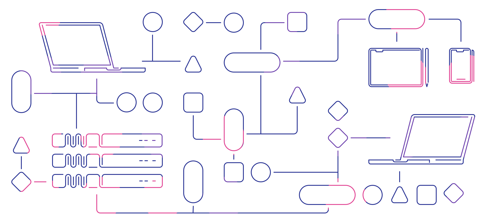

  

  

Hi, I am Eugene Ghanizadeh Khoub. I study informatics at [TUM](https://www.tum.de/en/), have helped out [@CafeBazaar](https://github.com/cafebazaar), [@CONNECT-platform](https://github.com/CONNECT-platform), and [@coding.blog](https://github.com/Coding-blog) and worked on [**CODEDOC**](https://github.com/CONNECT-platform/codedoc). Currently I work with [@ECOMPLY](https://github.com/ecomply) on data protection, help [@Divar](https://github.com/divar-ir) with product management, and try to see what comes out of [@Vitrine](https://github.com/vitrin-app).

👉 Here are the other (coding) stuff that (currently) interest me (and so I am working on):

## ⚡ Reactive Programming

Specifically, [RxJS](https://github.com/ReactiveX/rxjs) and more recently, [Callbags](https://github.com/callbag/callbag) and [Streamlets](https://github.com/loreanvictor/streamlet). Here are the stuff I work on in this area:

- [streamlets](https://github.com/loreanvictor/streamlet): a protocol for handling data/event streams (its like callbags but marginally faster and pausable by default).
- [callbag-common](https://github.com/loreanvictor/callbag-common): a hand-picked and patched collection of callbag utilities
- [callbag-expr](https://github.com/loreanvictor/callbag-expr): easy expressions with callbags
- [callbag-state](https://github.com/loreanvictor/callbag-state) and [callbag-state-keyed](https://github.com/loreanvictor/callbag-state-keyed): as-easy-as-it-gets and versatile state management using callbags
- [rxdeep](https://github.com/loreanvictor/rxdeep): same thing but for RxJS

## 🎨 Frontend Libraries

I love the idea of utilizing JSX with explicit reactive programming (so no VDOM, better performance, etc.). Stuff that I work on on this front:

- [graphis](https://github.com/loreanvictor/graphis): a convenient and stylish icon-font based on emojis
- [callbag-jsx](https://github.com/loreanvictor/callbag-jsx): JSX + callbags, tiny performant explicitly reactive frontend library
- [themed-jss](https://github.com/loreanvictor/themed-jss/): JSS with Theming and automatic dark mode support + integration for callbag-jsx and React
- [react-callbag-streams](https://github.com/loreanvictor/react-callbag-streams): a library for conveniently using callbag streams in React

## 🚀 Backend Tooling

- [serverless-cloud-data-utils](https://github.com/loreanvictor/serverless-cloud-data-utils): a convenient ORM for [Serverless Cloud](https://www.serverless.com/cloud)
- [TyFON](https://github.com/loreanvictor/tyfon): a zero-config TypeScript RPC
- [RxXpress](https://github.com/loreanvictor/rxxpress): an experimental mashup of RxJS and Express

## 🧐 Other

- [Kāshi](https://github.com/loreanvictor/kaashi): a turing-complete json-like language
- [My Blog](https://eugene.coding.blog): which I sometimes update with some new stuff
- [Also I write stuff on Dev.to](https://dev.to/loreanvictor)

  

